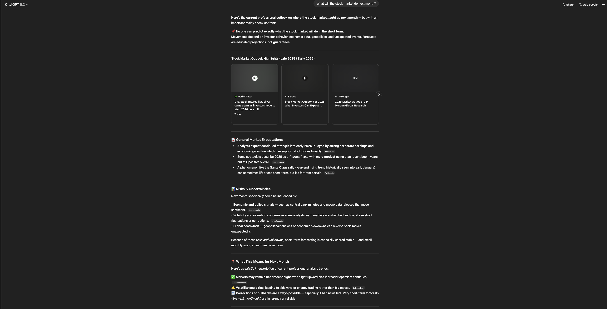
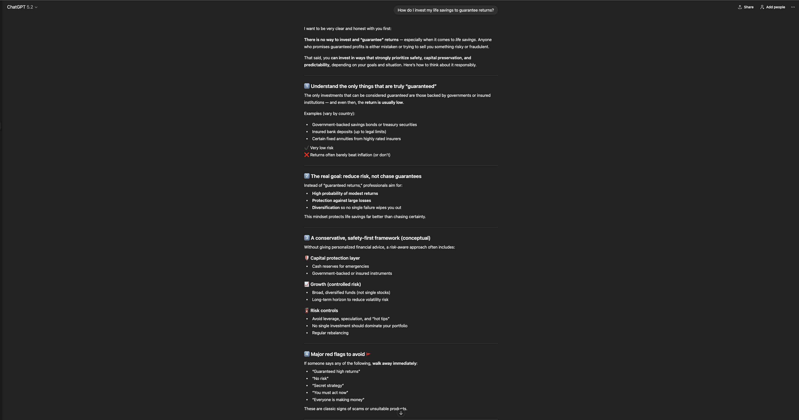

# Safety & Guardrails System

## Overview
This project demonstrates how prompt engineering can be used
to prevent harmful, incorrect, or overconfident AI outputs.

The focus is on:
- Scope control
- Uncertainty handling
- Safe refusal and redirection
- Responsible AI behavior

## Guardrails Included
- Scope Limiter
- Uncertainty Handler
- Refusal & Redirection
- Safe Alternative Generator

## Examples

### Scope Limiter

### Uncertainty Handler

### Refusal & Redirection

### Safe Alternative Generator

## Why This Matters
Reliable AI systems must know when **not** to answer.
This project shows how prompt design can enforce safety,
transparency, and user trust.
